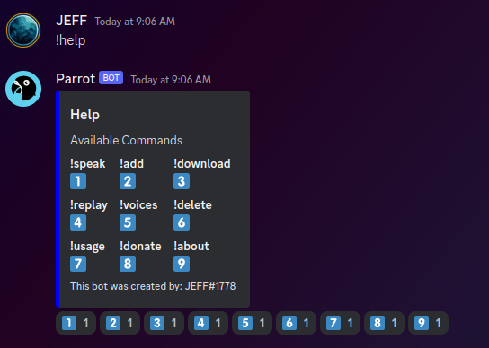

</img>

# Parrot Discord Bot

[Add Parrot to your discord server](https://discord.com/api/oauth2/authorize?client_id=1095014597871804510&permissions=3196992&scope=bot)

## About Parrot

Parrot is an interactive voice cloning bot created using [ElevenLabs](https://beta.elevenlabs.io/) and [OpenAi](https://platform.openai.com/) APIs.
The bot takes a voice and a string as inputs, joins your voice channel and speaks the string in the chosen voice. The optional 'gpt' argument uses the input string as a prompt for [ChatGPT](https://chat.openai.com/) and then speaks the response.

 

### Example use

 

