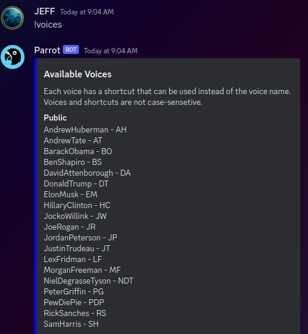

</img>

# Parrot Discord Bot

I shut downt the public bot because I could not get verified for 100+ discord servers

When I have time I will make an easily deployable version so that anyone can deploy it locally.

## About Parrot

Parrot is an interactive voice cloning bot created using [ElevenLabs](https://beta.elevenlabs.io/) and [OpenAi](https://platform.openai.com/) APIs.
The bot takes a voice and a string as inputs, joins your voice channel and speaks the string in the chosen voice. The optional 'gpt' argument uses the input string as a prompt for [ChatGPT](https://chat.openai.com/) and then speaks the response.

Excuse the horrendous quality. Github has a filesize limit on embeded videos [download the high quality version here](https://github.com/Ferdinand737/voice-clone-bot/raw/main/demo.mp4).

https://github.com/Ferdinand737/voice-clone-bot/assets/71345367/a81d5d9b-5d72-415b-80ac-619c6d43d149

### Example use

 

